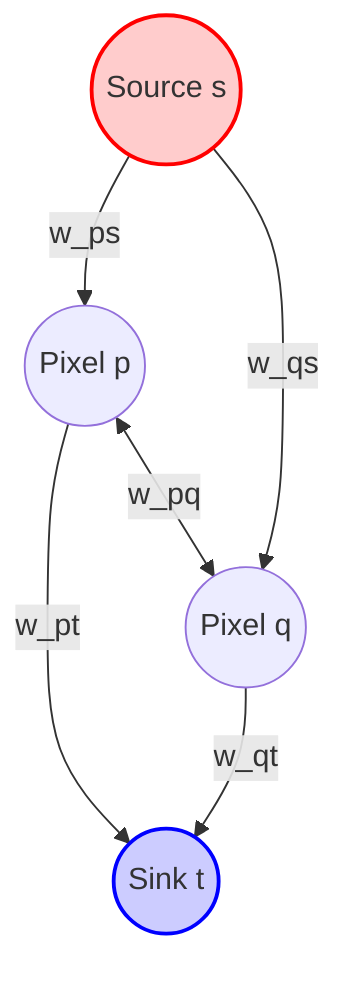
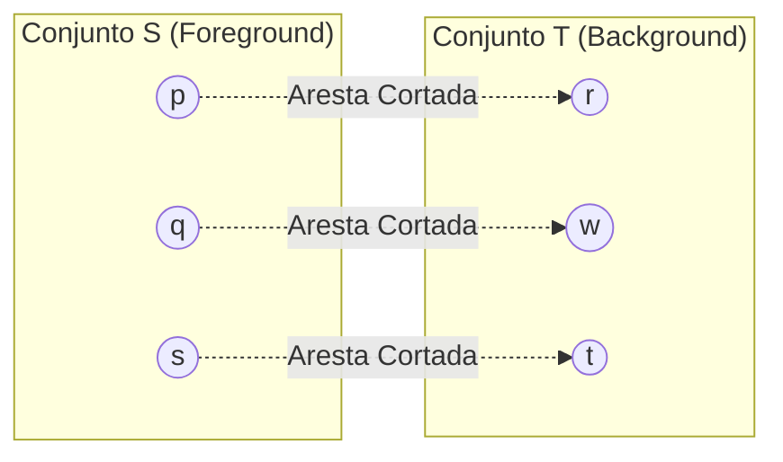
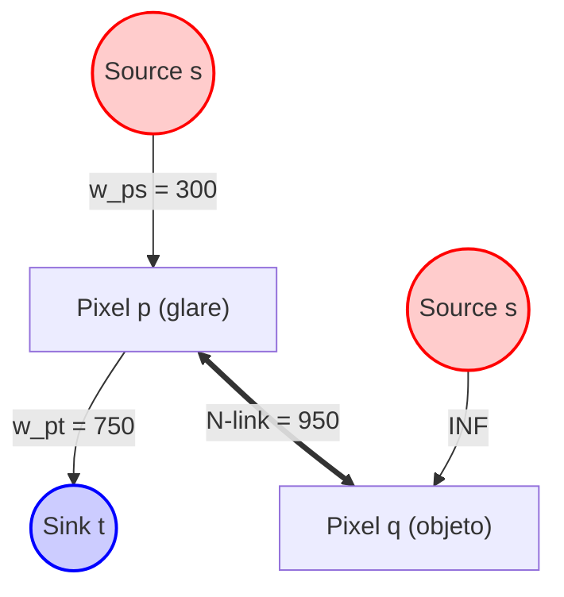

# Modelagem de Segmentação de Imagem via Graph Cuts

Este documento explica formalmente a matemática e a teoria por trás da segmentação interativa de imagens baseada no algoritmo de **Corte Mínimo / Fluxo Máximo (Min-Cut / Max-Flow)** e na formulação de campos aleatórios de Markov (MRF).

---

## 1. Formulação do Problema como Minimização de Energia

A segmentação de uma imagem pode ser vista como o problema de atribuir uma etiqueta (label) $x_p \in \{0, 1\}$ para cada pixel $p \in \mathcal{P}$, onde:
- $x_p = 1$ representa o **objeto (Foreground)**.
- $x_p = 0$ representa o **fundo (Background)**.

Uma segmentação completa da imagem é dada pelo vetor de estados $X = \{x_p \mid p \in \mathcal{P}\}$. A qualidade de uma segmentação é medida por uma função de energia de Gibbs baseada em campos aleatórios de Markov (MRF):

$$E(X) = E_{\text{region}}(X) + \lambda \cdot E_{\text{boundary}}(X)$$

Onde:
- $E_{\text{region}}(X)$ mede a penalidade de atribuir o pixel $p$ à classe $x_p$ baseando-se apenas na sua cor individual.
- $E_{\text{boundary}}(X)$ mede a penalidade de atribuir etiquetas diferentes a pixels vizinhos semelhantes (penalidade de descontinuidade).
- $\lambda \ge 0$ é um fator de escala de regularização espacial (no nosso programa, este balanço é ajustado de forma implícita pelas capacidades relativas e pelo parâmetro de sensibilidade de cor $\sigma$).

O objetivo é encontrar a configuração $X^*$ que minimiza globalmente essa energia:

$$X^* = \arg\min_{X} E(X)$$

Boykov e Jolly (2001) demonstraram que a minimização global dessa energia para sistemas binários pode ser mapeada exatamente em um problema de **Corte Mínimo em um Grafo de Fluxo**.

---

## 2. Construção do Grafo de Fluxo ($\mathcal{G}$)

Criamos um grafo direcionado $\mathcal{G} = (V, E)$ onde:
1. **Vértices ($V$)**: 
   Cada pixel $p \in \mathcal{P}$ corresponde a um nó do grafo. Adicionalmente, inserimos dois nós terminais especiais virtuais:
   - A **Source ($s$)** (representando o terminal de Foreground).
   - O **Sink ($t$)** (representando o terminal de Background).
   
   Logo, $V = \mathcal{P} \cup \{s, t\}$.

2. **Arestas ($E$)**:
   - **N-links (Neighbor links)**: Arestas direcionadas conectando pixels adjacentes (no nosso caso, vizinhos imediatos na grade de 4-conectividade).
   - **T-links (Terminal links)**: Arestas direcionadas conectando cada nó de pixel $p$ aos terminais $s$ e $t$. Cada pixel tem dois t-links: $(s, p)$ e $(p, t)$.

---

## 3. Definição Matemática dos Pesos (Capacidades)

As capacidades de fluxo de cada aresta determinam o comportamento físico da segmentação.

### N-links (Penalidade de Fronteira)
O peso do link entre dois pixels vizinhos $p$ e $q$ é definido pela similaridade local de cor. Se os pixels vizinhos forem parecidos, a aresta de conexão deve ser muito forte (alta capacidade), tornando difícil cortá-la. Se houver grande contraste de cor entre eles, a aresta é fraca (baixa capacidade) e barata de cortar.

$$w_{pq} = K \cdot \exp\!\left(-\frac{\lVert I_p - I_q \rVert^2}{2\sigma^2}\right)$$

Onde:
- $I_p = (R_p, G_p, B_p)$ é o vetor tridimensional de cor do pixel $p$.
- $\lVert I_p - I_q \rVert$ é a distância euclidiana no espaço de cores RGB.
- $\sigma$ é a sensibilidade de contraste (um sigma maior torna a queda do exponencial mais suave, aumentando o peso dos n-links de forma geral e tornando a segmentação mais coesa).
- $K = 1000$ é um fator de escala para trabalharmos com fluxo em valores inteiros de alta precisão.

### T-links (Similaridade Regional)
Os t-links atraem os pixels para a classe correta com base no conjunto de sementes marcadas pelo usuário: $\mathcal{S}_{\text{fg}}$ (sementes de Foreground) e $\mathcal{S}_{\text{bg}}$ (sementes de Background).

#### Para Pixels Marcados (Sementes)
Se o usuário marcou explicitamente o pixel no objeto ou no fundo, a decisão é absoluta. Usamos capacidade infinita ($\infty \approx \text{INF}$) para prender o pixel ao terminal correspondente:

| Pixel $p$ | Capacidade do Link $(s, p)$ ($w_{ps}$) | Capacidade do Link $(p, t)$ ($w_{pt}$) |
|---|---|---|
| $p \in \mathcal{S}_{\text{fg}}$ | $\infty$ | $0$ |
| $p \in \mathcal{S}_{\text{bg}}$ | $0$ | $\infty$ |

#### Para Pixels Não Marcados (Heurística do Vizinho Mais Próximo)
Em vez de calcular a média global das cores das sementes, o algoritmo calcula a **menor distância de cor** que o pixel $p$ possui em relação a qualquer semente individual de cada classe:

$$d_{\text{min}}(p, \mathcal{S}_{\text{fg}}) = \min_{s_j \in \mathcal{S}_{\text{fg}}} \lVert I_p - I_{s_j} \rVert$$

$$d_{\text{min}}(p, \mathcal{S}_{\text{bg}}) = \min_{s_j \in \mathcal{S}_{\text{bg}}} \lVert I_p - I_{s_j} \rVert$$

As capacidades dos t-links são então calculadas aplicando a função gaussiana de decaimento exponencial sobre essa distância mínima no espaço RGB:

$$w_{ps} = \max\!\left( K \cdot \exp\!\left(-\frac{d_{\text{min}}(p, \mathcal{S}_{\text{fg}})^2}{2\sigma^2}\right), 1 \right)$$

$$w_{pt} = \max\!\left( K \cdot \exp\!\left(-\frac{d_{\text{min}}(p, \mathcal{S}_{\text{bg}})^2}{2\sigma^2}\right), 1 \right)$$

> [!NOTE]
> O uso do operador $\max(\dots, 1)$ garante que a capacidade mínima do link seja $1$ (e não zero), o que evita arestas de peso zero e previne instabilidades de conectividade no resolvedor de fluxo.

---

## 4. Teorema Max-Flow / Min-Cut e Equivalência Teórica

Um **corte** (cut) $C = (S, T)$ no grafo direcionado $\mathcal{G}$ é uma partição dos vértices em dois conjuntos disjuntos $S$ e $T$ tais que a Source $s \in S$ e o Sink $t \in T$.

A **capacidade do corte** $c(S, T)$ é a soma dos pesos de todas as arestas direcionadas que saem do conjunto $S$ e entram no conjunto $T$:

$$c(S, T) = \sum_{u \in S, v \in T, (u,v) \in E} w_{uv}$$

### Otimização Global

Minimizar a capacidade do corte $c(S, T)$ é **exatamente equivalente** a encontrar o vetor de estados $X^*$ que minimiza a energia MRF $E(X)$. Ao cortar arestas de menor capacidade:
- Se cortarmos o t-link $(p, t)$, o pixel $p$ fica no conjunto $S$ (Foreground). Pagamos o custo de similaridade do pixel com o fundo ($w_{pt}$).
- Se cortarmos o t-link $(s, p)$, o pixel $p$ fica no conjunto $T$ (Background). Pagamos o custo de similaridade com o objeto ($w_{ps}$).
- Se pixels vizinhos $p$ e $q$ forem divididos em conjuntos diferentes ($p \in S$, $q \in T$), cortamos o n-link $w_{pq}$ e pagamos o custo de fronteira de contraste.

Pelo **Teorema de Ford-Fulkerson**, o valor do Fluxo Máximo que pode ser empurrado da Source para o Sink é exatamente igual à capacidade do Corte Mínimo. Assim, executamos um solver de fluxo (como o *Push-Relabel Improved*) para saturar a rede, obtendo o menor corte global de energia de forma matematicamente precisa.

---

## 5. Dinâmica de Desempate e Regularização Espacial

A principal vantagem de modelar a segmentação como um grafo global (e não apenas classificar cada pixel individualmente por cor) é a **regularização espacial**. O equilíbrio entre os T-links e os N-links desempata conflitos de cor locais.

### Dinâmica 1: T-link aponta Fundo ($w_{pt} > w_{ps}$), mas vira Objeto (Foreground)

Imagine um pixel $p$ que faz parte de uma região de reflexo ou brilho (*glare*) no corpo do balão.
- **T-links**: Por ser muito claro/branco, a cor do pixel de brilho é ligeiramente mais parecida com a cor do céu de fundo do que com a cor das sementes escuras do balão. Logo, o peso do t-link para o Sink é forte:
  
  $$w_{pt} = 750 \quad \text{vs} \quad w_{ps} = 300$$
  
  O pixel é individualmente atraído para o fundo (Sink).

- **N-links**: Porém, esse pixel de brilho está **fisicamente cercado** por outros pixels vermelhos do balão que estão solidamente conectados à Source por t-links de valor infinito ($INF$). As transições de cor internas dentro do balão são suaves, o que gera N-links vizinhos muito fortes:
  
  $$w_{pq} \approx 950$$

Para classificar o pixel de brilho $p$ como fundo (Sink), o corte precisaria passar ao redor dele, o que exige cortar todas as arestas N-links que o conectam ao resto do balão.
- Custo de cortar os N-links e mandar para o fundo:
  
  $$\text{Custo}(p \in \text{Background}) = w_{ps} + \sum_{q} w_{pq} = 300 + 4 \cdot 950 = 4100$$

- Custo de cortar o t-link e mantê-lo no objeto:
  
  $$\text{Custo}(p \in \text{Foreground}) = w_{pt} = 750$$

Como $750 \ll 4100$, o algoritmo de corte global prefere cortar o t-link de 750 e manter o pixel de brilho classificado no **Foreground**. A coesão espacial local vence a semelhança de cor individual.

### Dinâmica 2: T-link aponta Objeto ($w_{ps} > w_{pt}$), mas vira Fundo (Background)

Imagine um pequeno ruído ou pixel de folha verde no céu de fundo que possui exatamente a mesma cor verde de um objeto no centro.
- **T-links**: Por ter cor verde idêntica à do objeto, a atração de cor para o objeto é forte:
  
  $$w_{ps} = 900 \quad \text{vs} \quad w_{pt} = 100$$

- **N-links**: No entanto, esse pixel de ruído está isolado no céu azul de fundo. O céu azul é homogêneo, logo o ruído está conectado aos vizinhos de fundo por links fracos ou homogêneos, mas os vizinhos do céu azul por sua vez estão conectados ao Sink ($t$) por t-links fortíssimos de background. Para o ruído virar objeto, o algoritmo teria que desenhar uma borda fechada cortando todos os N-links vizinhos ao redor desse único pixel.
- O custo de criar uma "ilha" de foreground isolada no meio do fundo é muito superior à capacidade do t-link individual. O Min-Cut corta o t-link de 900 e classifica o ruído como **Background**, limpando o ruído automaticamente e garantindo contornos suaves e contínuos.
